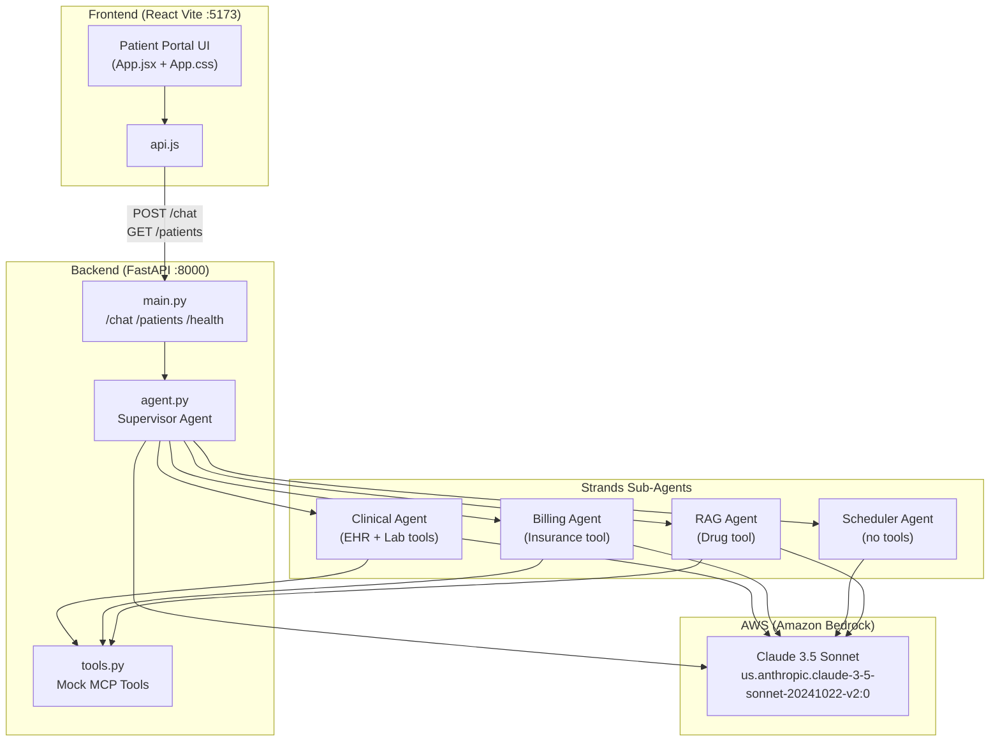

# Design Document: Healthcare AI POC

## Overview

The Healthcare AI POC is a full-stack application demonstrating a multi-agent AI architecture for healthcare workflows. A React (Vite) frontend communicates with a Python FastAPI backend. The backend hosts a Strands supervisor agent that routes natural language queries to four specialized sub-agents, each backed by mock tools simulating real healthcare data integrations. All LLM inference runs through Amazon Bedrock (Claude 3.5 Sonnet).

This is a local POC — no authentication, no database, no streaming, no cloud deployment. AWS credentials are sourced from `~/.aws/credentials`.

## Architecture



## Components and Interfaces

### Backend: `main.py`

FastAPI application entry point. Configures CORS and defines three endpoints.

```
POST /chat
  Request:  { "message": str, "patient_id": str }
  Response: { "reply": str }

GET /patients
  Response: [ { "id": str, "name": str }, ... ]

GET /health
  Response: { "status": "ok" }
```

CORS is configured to allow `http://localhost:5173` with all methods and headers.

### Backend: `tools.py`

Four Strands `@tool`-decorated functions. All data is hardcoded — no external calls.

| Tool | Parameters | Returns |
|---|---|---|
| `ehr_lookup` | `patient_id: str` | Patient record dict (name, age, condition, medications, last_visit, vitals) |
| `lab_results` | `patient_id: str` | Lab results dict (test name → value pairs) |
| `drug_lookup` | `drug_name: str` | Drug info dict (interactions, formulary_tier, generic_available, covered) |
| `insurance_check` | `patient_id: str, procedure_code: str = "99213"` | Insurance eligibility dict |

### Backend: `agent.py`

Strands multi-agent setup using `BedrockModel`.

**Model configuration:**
```python
model = BedrockModel(model_id="us.anthropic.claude-3-5-sonnet-20241022-v2:0")
```

**Sub-agents** (each is a `Agent` instance with its own system prompt and tool subset):

| Agent | Tools | System Prompt Focus |
|---|---|---|
| `clinical_agent` | `ehr_lookup`, `lab_results` | Clinical data retrieval, patient summaries, diagnoses |
| `billing_agent` | `insurance_check` | Insurance eligibility, claims, pre-authorization |
| `scheduler_agent` | _(none)_ | Appointment scheduling, reminders, follow-up planning |
| `rag_agent` | `drug_lookup` | Drug interactions, formulary lookups, clinical protocols |

**Supervisor agent:** Receives the user query + patient_id, selects the appropriate sub-agent as a tool, and returns the final response. Sub-agents are wrapped as callable tools for the supervisor.

### Frontend: `api.js`

```javascript
const BASE = "http://localhost:8000";

export async function getPatients()
  // GET /patients → array of patient objects

export async function sendMessage(message, patientId)
  // POST /chat with { message, patient_id } → { reply }
```

### Frontend: `App.jsx`

Two-panel layout:

- **Left: Patient_Sidebar** — patient list fetched on mount, click to select, colored status dots, quick query buttons
- **Right: Chat_Panel** — message history, input bar, loading animation, header with patient name + Bedrock badge

State:
- `patients` — list from API
- `selectedPatient` — currently active patient object
- `messages` — array of `{ role: "user"|"agent", text: string }`
- `loading` — boolean for pending request

## Data Models

### Patient (frontend + `/patients` response)
```typescript
{
  id: string;       // "P001" | "P002"
  name: string;     // "Priya Nair" | "Arjun Mehta"
}
```

### Chat Message (frontend state)
```typescript
{
  role: "user" | "agent";
  text: string;
}
```

### Chat Request (POST /chat body)
```typescript
{
  message: string;
  patient_id: string;
}
```

### Chat Response (POST /chat response)
```typescript
{
  reply: string;
}
```

### EHR Record (EHR_Tool output)
```python
{
  "name": str,
  "age": int,
  "condition": str,
  "medications": list[str],
  "last_visit": str,       # ISO date string
  "vitals": {
    "bp": str,
    "spo2": str,
    "hr": str
  }
}
```

### Lab Results (Lab_Tool output)
```python
{
  "<test_name>": str,   # e.g. "hba1c": "7.2%"
  "status": str
}
```

### Drug Info (Drug_Tool output)
```python
{
  "interactions": list,
  "formulary_tier": int,
  "generic_available": bool,
  "covered": bool
}
```

### Insurance Eligibility (Insurance_Tool output)
```python
{
  "patient_id": str,
  "payer": str,
  "eligible": bool,
  "pre_auth_required": bool,
  "deductible_met": bool,
  "copay": str,
  "procedure_code": str
}
```

## Correctness Properties

A property is a characteristic or behavior that should hold true across all valid executions of a system — essentially, a formal statement about what the system should do. Properties serve as the bridge between human-readable specifications and machine-verifiable correctness guarantees.

Property 1: EHR lookup returns known patients
*For any* patient_id in {"P001", "P002"}, calling `ehr_lookup` should return a dict containing the keys "name", "age", "condition", "medications", "last_visit", and "vitals".
**Validates: Requirements 2.1**

Property 2: EHR lookup unknown patient returns error
*For any* patient_id not in {"P001", "P002"}, calling `ehr_lookup` should return a dict with key "error" equal to "Patient not found".
**Validates: Requirements 2.2**

Property 3: Lab results unknown patient returns error
*For any* patient_id not in {"P001", "P002"}, calling `lab_results` should return a dict with key "error" equal to "No labs found".
**Validates: Requirements 2.4**

Property 4: Drug lookup always returns required fields
*For any* drug_name string, calling `drug_lookup` should return a dict containing the keys "interactions", "formulary_tier", "generic_available", and "covered".
**Validates: Requirements 2.5, 2.7**

Property 5: Insurance check always returns required fields
*For any* patient_id string and any procedure_code string, calling `insurance_check` should return a dict containing the keys "patient_id", "payer", "eligible", "pre_auth_required", "deductible_met", "copay", and "procedure_code".
**Validates: Requirements 2.6**

Property 6: Chat endpoint returns reply field
*For any* valid message string and patient_id string, a POST to `/chat` should return a JSON object containing a non-empty "reply" string field.
**Validates: Requirements 1.1, 1.5**

Property 7: Patients endpoint returns both patients
*For any* call to GET `/patients`, the response should be a list of exactly 2 objects each containing "id" and "name" fields.
**Validates: Requirements 1.2**

Property 8: sendMessage includes correct headers and body
*For any* message string and patientId string, calling `sendMessage(message, patientId)` should produce a fetch call with method POST, Content-Type application/json, and a body containing both `message` and `patient_id` fields.
**Validates: Requirements 6.2, 6.3**

## Error Handling

- **Unknown patient in tools**: EHR_Tool and Lab_Tool return `{"error": "..."}` dicts. Agents receive this as tool output and should relay the error naturally in their response.
- **Unknown drug in Drug_Tool**: Returns a safe default dict (no crash).
- **Bedrock API errors**: Strands agents will surface exceptions. For the POC, these propagate as HTTP 500 from FastAPI. No custom error handling required.
- **Frontend fetch errors**: For the POC, errors are not explicitly handled — the loading state will remain. No error UI required.
- **Missing patient selection**: The frontend quick-query buttons and send action should only be active when a patient is selected.

## Testing Strategy

### Unit Tests

Unit tests verify specific examples and edge cases for the mock tools and API layer:

- `ehr_lookup("P001")` returns the expected Priya Nair record
- `ehr_lookup("UNKNOWN")` returns `{"error": "Patient not found"}`
- `lab_results("P002")` returns the expected Arjun Mehta labs
- `lab_results("UNKNOWN")` returns `{"error": "No labs found"}`
- `drug_lookup("metformin")` returns tier 1, covered, no interactions
- `drug_lookup("unknown_drug")` returns the default fallback dict
- `insurance_check("P001")` returns the expected eligibility dict
- GET `/health` returns `{"status": "ok"}`
- GET `/patients` returns a list of 2 patients

### Property-Based Tests

Property tests use [Hypothesis](https://hypothesis.readthedocs.io/) (Python) to validate universal properties across generated inputs.

Each property test runs a minimum of 100 iterations.

| Property | Test Description | Tag |
|---|---|---|
| Property 2 | EHR unknown patient error | `Feature: healthcare-poc, Property 2` |
| Property 3 | Lab unknown patient error | `Feature: healthcare-poc, Property 3` |
| Property 4 | Drug lookup always returns required fields | `Feature: healthcare-poc, Property 4` |
| Property 5 | Insurance check always returns required fields | `Feature: healthcare-poc, Property 5` |

**Property test configuration (Hypothesis):**
```python
from hypothesis import given, settings
from hypothesis import strategies as st

@settings(max_examples=100)
@given(st.text())
def test_drug_lookup_always_has_required_fields(drug_name):
    result = drug_lookup(drug_name)
    assert "interactions" in result
    assert "formulary_tier" in result
    assert "generic_available" in result
    assert "covered" in result
```

Properties 1, 6, 7, and 8 are covered by unit/integration tests (finite known inputs or HTTP endpoint tests).
